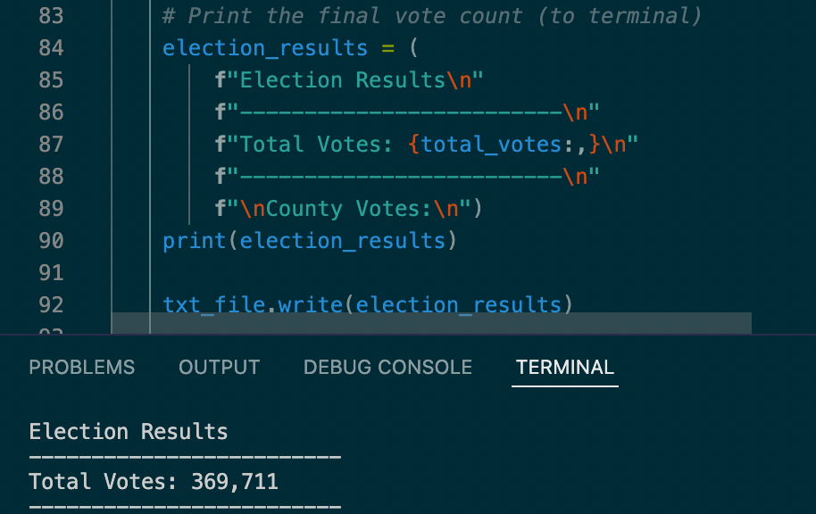
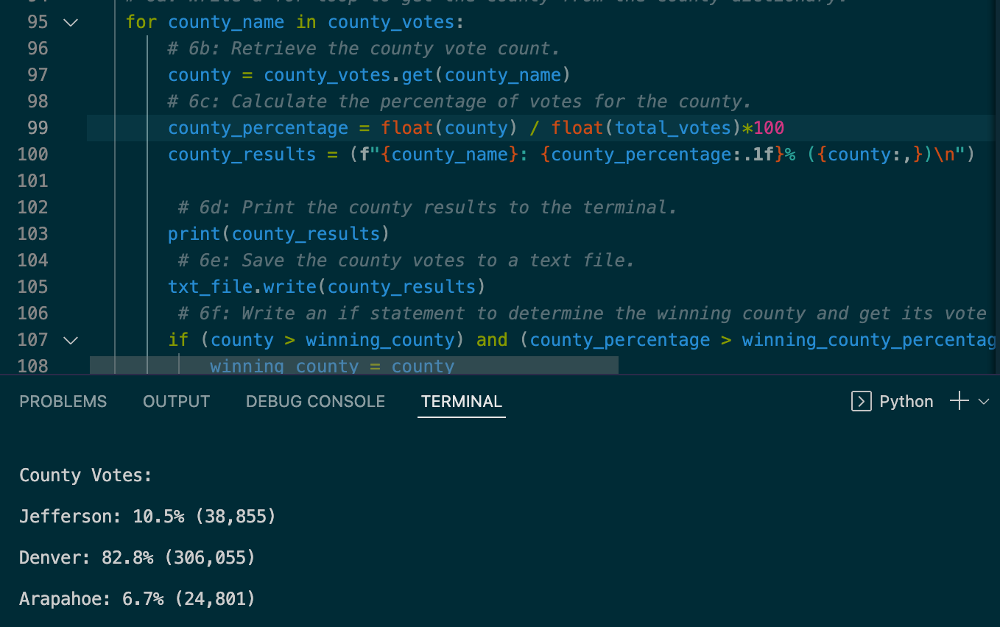
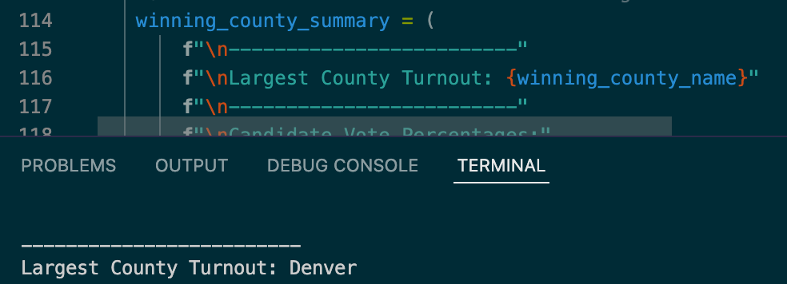
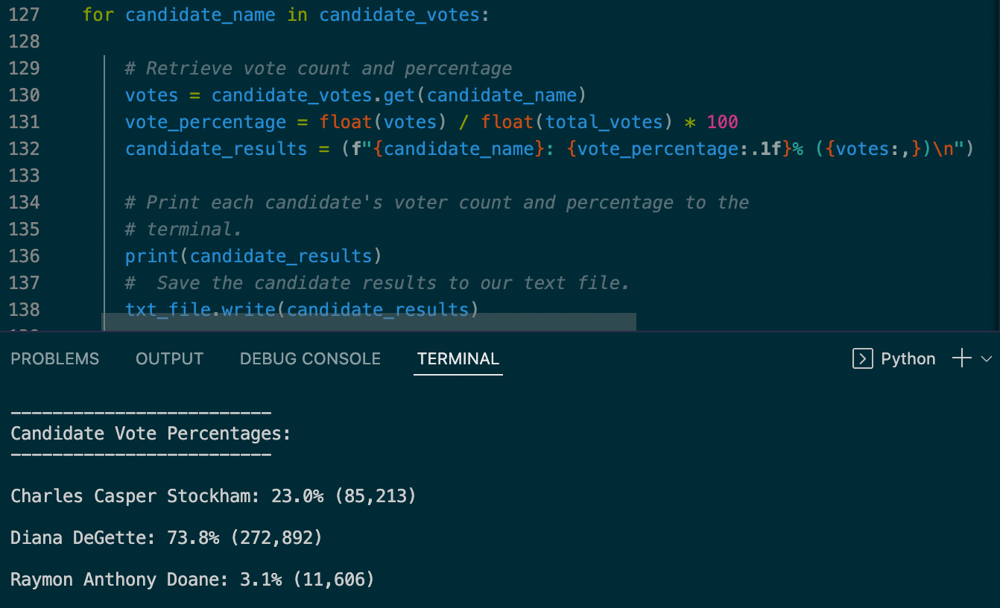
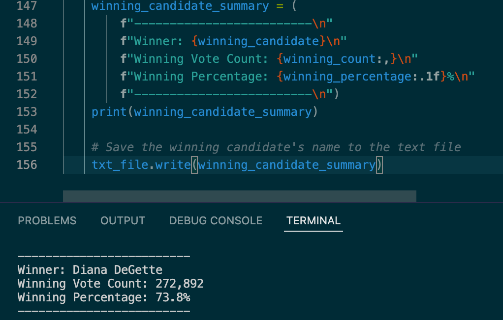
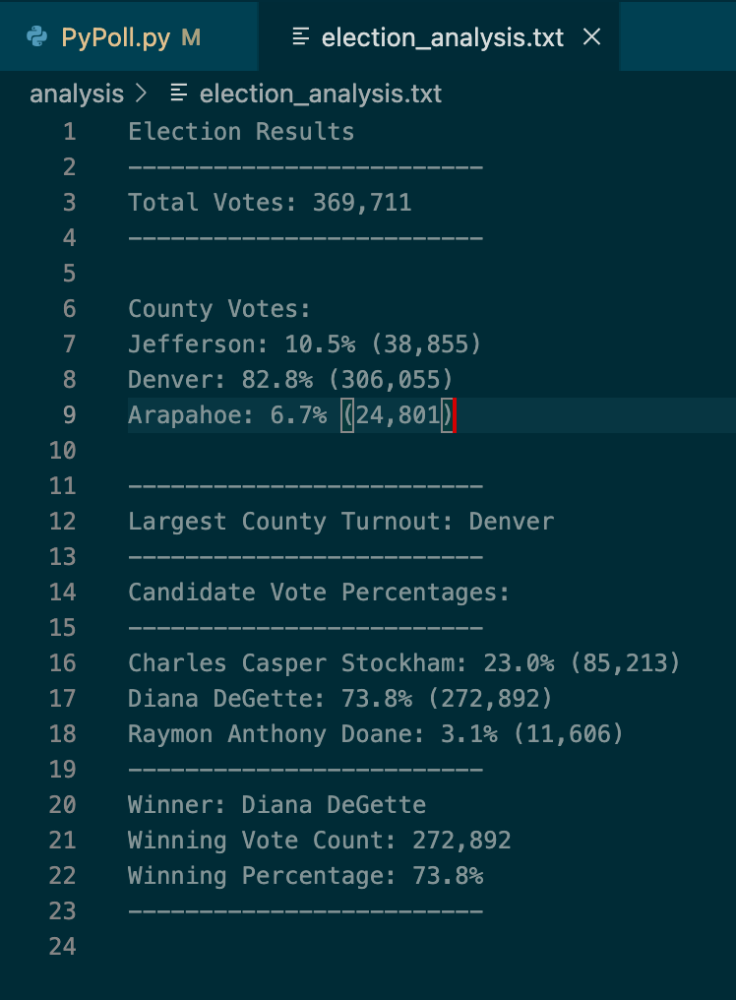

# Election_Analysis
# Overview of Election Audit:

The purpose of this election audit is to provide a written analysis to the election commission, by providing: the total vote count and its’ percentage for each county, the winning county, accompanied with the winning candidate (based on popular vote).

# Election Audit Results and their Code:
***
Total votes cast in the congressional election 
* The total congressional votes cast was 369,711

# Total votes and their percentages per County 
*	Jefferson county had 10.5% of the votes with a total of 38,855 votes.
*	Denver county had 82.8% of the votes with a total of 306,055 votes.
*	Arapahoe county 6.7% of the votes with a total of 24,801 votes. 

# Largest Turnout (County)
*	The County with the largest total votes was Denver, with 82.8% (306,055 votes).

# Total votes and their percentages per Candidate 
*	Charles Casper Stockham had 23.0% of the votes, with a total of 85,213 votes. 
*	Diana DeGette had 73.8% of the votes, with a total of272,892 votes.
*	Raymon Anthony Doane had 3.1% of the votes, with a total of 11,606 votes.

 
# Winning Candidate
*	The winner of the election was Diana DeGette, who had 73.8% of the votes and 272, 892 of the total votes! 

# Text File of the Election Results 

# Election Audit Summary 
